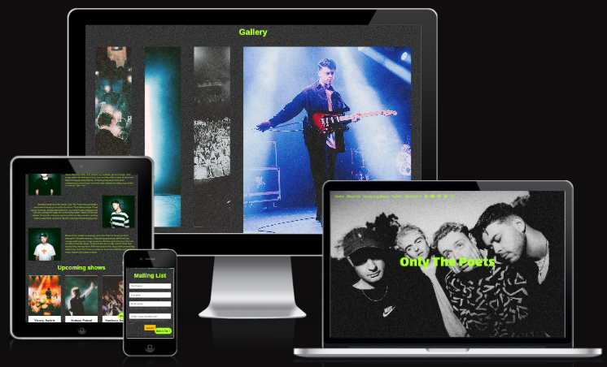

# **Only The Poets band page**

## **Site Overview**

Only The Poets are a established pop-rock band in the music industry based out of Reading in the United Kingdom.

This website is designed to help fans and music industry professionals gain an insite band, see upcoming gigs and view images of recent gigs.

With a clear artistic style the which is shared across all the bands social media, this website aims to be a natural extension of the bands identity.

## Table of contents:

1. [**Site Overview**](#site-overview)
2. [**Planning stage**](#planning-stage)
   - [**_Target Audiences_**](#target-audiences)
   - [**_User Stories_**](#user-stories)
   - [**_Site Aims_**](#site-aims)
   - [**_How Will This Be Achieved_**](#how-will-this-be-achieved)
   - [**_Wireframes_**](#wireframes)
   - [**_Colour Scheme_**](#colour-scheme)
   - [**_Typography_**](#typography)
3. [**Features**](#features)
   - [**_Nav Bar/Menu_**](#nav-bar/menu)
   - [**_Hero Image_**](#hero-image)
   - [**_About us_**](#about-us)
   - [**_Upcoming Gigs_**](#upcoming-gigs)
   - [**_Gallery_**](#gallery)
   - [**_Mailing List_**](#mailing-list)
   - [**_Footer_**](#footer)
   - [**_Background_**](#background)
   - [**_Back To Top Button_**](#back-to-top-button)
   - [**_404 and Thankyou Page_**](#404-and-thankyou-page)
4. [**Future Enhancements**](#future-enhancements)
5. [**Testing**](#testing)
6. [**Deployment**](#deployment)
7. [**Credits**](#credits)
   - [**_Honourable Mentions_**](#honourable-mentions)
   - [**_General Reference_**](#general-refrence)
   - [**_Content_**](#content)
   - [**_Media_**](#media)

---

## **Planning stage**

### **Target Audiences:**

- Fans of the band, both new and old. Looking for tour dates and information about the band.
- Potential venues and festivals trying to find contact information.
- Potential booking agents and music industry contacts.

### **User Stories:**

- As a user, I want to see images of the band both onstage and in shoots.
- As a user, I want to see upcoming live shows locations and dates.
- As a user, I want to learn more about the band.
- As a user, I want to navigate my way to all available social media accounts.
- As a user, I want to join a mailing list to be informed when they are coming to location near me or selling merchendise.

### **Site Aims:**

- To be a professional first impression to the industry.
- To highlight the members of the band and who they are.
- To push people to the bands other social media sites.
- To engage with people via a mailing list, to allow the band to talk to the people who are following them directly.
- To show the impressive photography surrounding the band which tie in with their latest social media campaigns.
-

### **How Will This Be Achieved:**

- The site will need to look professional and modern, as the audience is younger it will need to be optimised for mobile.
-
-
-

### **Wireframes:**

To organize my thoughts and prevent scope creep, I created wireframes for this project. Below are links to each of the mobile and desktop versions of the site.

- Mobile Wireframes:

- Desktop wireframes:
  

### **Colour Scheme:**

When deciding the color scheme, I was heavily influenced by the style of released images on their social media and the merchedise that has been released over the last few months. With dark backgrounds and contrasting light text featuring heavily in both, they use color sparingly often with deep reds which can be see in XXXXXX

### **Typography**

Throughout the page, there are three fonts used:

- Lalezar - For the title to give it a strong presence.
- Arimo - For all other headings including the navbar.
- Didact Gothic - for all content text.

I was lucky in the fact that the band already had a font (Neue Haas Grotesk) that they used for posters and social media, I was able to review this and choose a similar font after reading about the inspiration behind the font. Using 'Fontjoy.com' to help build my font pairings I was able to find 3 fonts I was happy to use.

- All fonts were sourced from Google fonts, as stated in the credits.

---

## **Features**

Below are some of the features currently within the site.

### **Nav Bar/Menu:**

- The Navbar menu is fully responsive,

### **Hero Image:**

- The hero image is intended to be a full screen image with, to ensure the first thing visitors see is the members of the band.

- The image a

### **About us:**

- General Overview
- Band Members

### **Upcoming Gigs:**

- I wanted to ensure the upcoming gigs was clearly visible and really popped against the rest of the website, so I wanted to use cards

### **Gallery**

### **Mailing List**

### **Footer:**

### **Background**

- My intention with the background was to replicate the heavy grain that is shared across all of the bands social media images, with low light photography including heavy grain the band has

### **Back To Top Button**

### **404 and Thankyou Page**

---

## **Future-Enhancements**

-

-

-

-

## **Testing**

I have included details of testing both during development and post development in a separate document called [TESTING.md](TESTING.md).

---

## **Deployment**

I deployed the page on GitHub pages via the following procedure: -

1. From the project's [repository](), go to the **Settings** tab.
2. From the left-hand menu, select the **Pages** tab.
3. Under the **Source** section, select the **Main** branch from the drop-down menu and click **Save**.
4. A message will be displayed to indicate a successful deployment to GitHub pages and provide the live link.

You can find the live site via the following URL -

---

## **Credits**

### **Honorable mentions**

This project could not have happened without the support of the following people listed in no particular order:

-

### **General reference:**

- The project was influenced by the Code Institutes code along project called Love running. Whilst I have tried to deviate as much as possible there may be some similarities in the code.
- I relied upon W3schools, MDN web docs and stack overflow for general references throughout the project.

### **Content:**

- All content was written by myself.
- Icons in the Navbar and Footer were taken from [Font Awesome](https://fontawesome.com)
- All fonts imported from - [Google Fonts](https://fonts.google.com/)
- Accessibility checker - [WAVE - Web accessibility evaluation tool](https://wave.webaim.org/)
- Gallery CSS inspiration from - [SLIDER REVOLUTION](https://www.sliderrevolution.com/resources/css-gallery/)

### **Media:**

-
